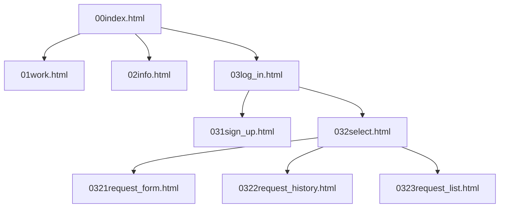
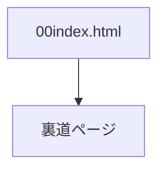
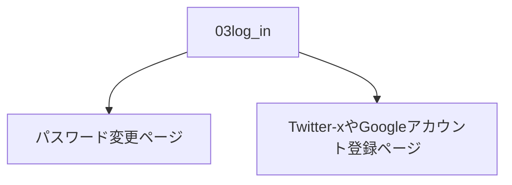
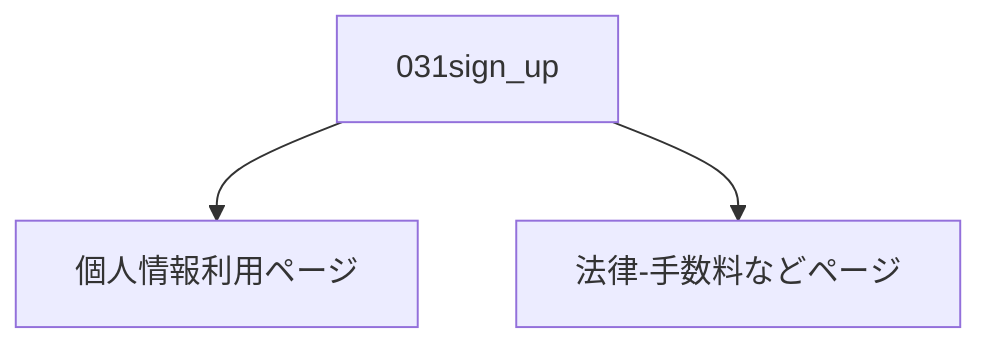
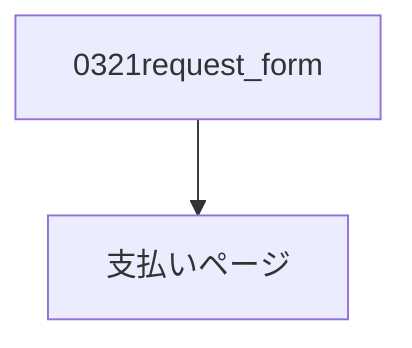

# 説明

## 画面一覧表

|番目|No.|ファイル名|内容|遷移|
|:-------------|:-------------|:------------:|:------------:|:-------------|
|01|00|00index.html|始まり|00|
|02|01|01work.html|事務内容|00-01|
|03|02|02info.html|事務所情報|00-02|
|04|03|03log_in.html|ログイン画面|00-03|
|05|031|031sign_up.html|新規会員|00-03-031|
|06|032|032select.html|ログイン後選択画面|00-03-032|
|07|0321|0321request_form.html|依頼新規作成|00-03-032-0321|
|08|0322|0322request_history.html|依頼履歴|00-03-032-0322|
|09|0323|0323request_list.pngy.html|依頼受け取り(作成X)|00-03-032-0323|
|10|04|style.css|デザイン・スタイル|なし|
|11|05|js.js|振る舞い|なし|

## 実装していない機能
1.

条件（実装済）
- index.htmlの"青藍探偵事務所"をクリック
- consoleパネルでページリンク表示
  

2.

3.

4.
