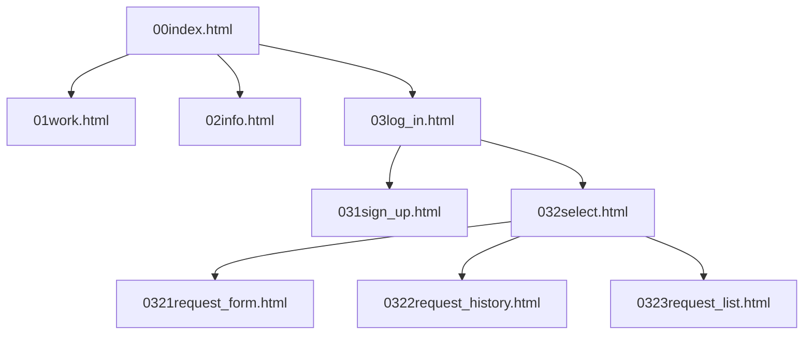
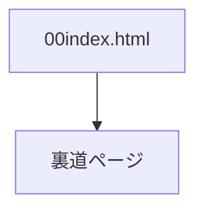
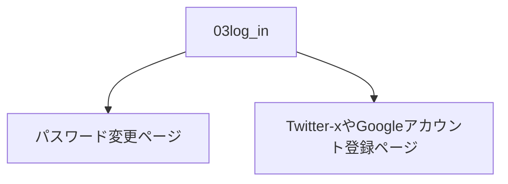
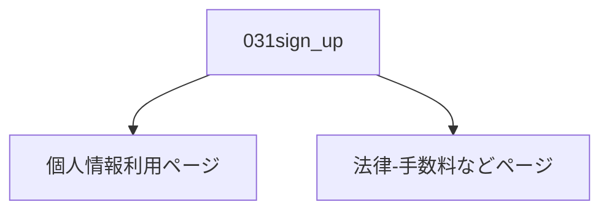
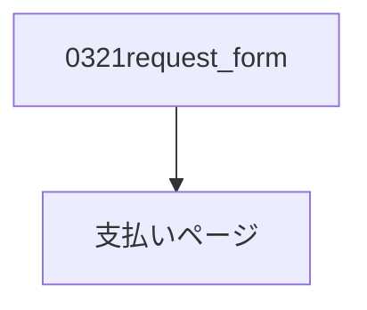

# 説明
本ドキュメントは、制作したWebページの構成および工夫点をまとめた説明書です。

## 目次
(ページ中の特定場所へのジャンプ)
- [画面一覧表](#画面一覧表)
- [工夫したこと](#工夫したこと)  
- [画面構成](#画面構成)

- [実装していない機能](#実装していない機能)

## 画面一覧表

|番目|No.|ファイル名|内容|遷移|
|:-------------|:-------------|:------------:|:------------:|:-------------|
|01|00|00index.html|始まり|00|
|02|01|01work.html|事務内容|00-01|
|03|02|02info.html|事務所情報|00-02|
|04|03|03log_in.html|ログイン画面|00-03|
|05|031|031sign_up.html|新規会員|00-03-031|
|06|032|032select.html|ログイン後選択画面|00-03-032|
|07|0321|0321request_form.html|依頼新規作成|00-03-032-0321|
|08|0322|0322request_history.html|依頼履歴|00-03-032-0322|
|09|0323|0323request_list.pngy.html|依頼受け取り(作成X)|00-03-032-0323|
|10|04|style.css|デザイン・スタイル|なし|
|11|05|js.js|振る舞い|なし|

## 工夫したこと
1. できるだけ実際の画面要素を並びました
    
    
2. 最初から構成番号を決める
    
3. ユーザー視点から　最初開くページ(のリンク)を明確的に置くこと
    
4. プログラマ視点から　様式のコメントを詳細記録すること。可読性とメンテナンス性の向上

 

---
 

 ---

 

## 画面構成
0. index.html

 

1. work.html
   
 

2. info.html
   
 

3. log_in.html
   
 

4. sign_up.html
   
 

5. select.html
   
 

6. request_form.html
   
 

7. request_history.html
   
 

8. request_list.html
   
 

## 実装していない機能
1.

条件（実装済）
- index.htmlの"青藍探偵事務所"をクリック
- consoleパネルでページリンク表示
  

2.

3.

4.

 ---
2026年9月14日  
ZHAO YUJING(チョウ　ユウキョウ)